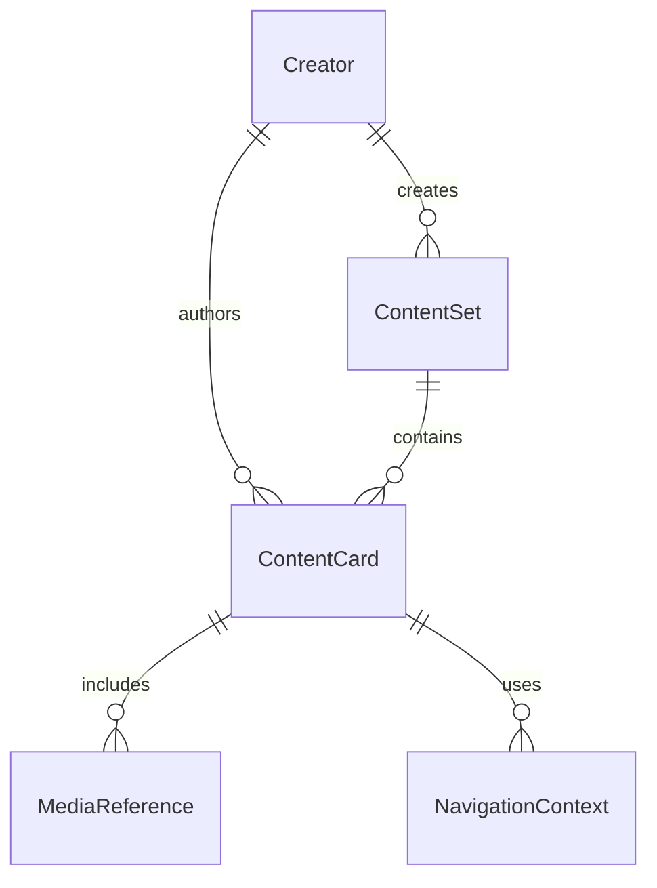

# Database Structure Documentation

## Overview

The Info-Navigator project uses a JSON-based database system for development and prototyping. The database consists of three main collections stored as separate JSON files, designed with a Netflix-style content organization approach.

## Database Files Structure

```
/data/
├── creators.json      # Creator profiles (Netflix-style content creators)
├── content_sets.json  # Content collections/series (like TV shows)
└── cards.json         # Individual content cards (like episodes)
```

## Core Entities

### 1. Creator Entity (`creators.json`)

Netflix-style creator profiles that own and create content sets.

```json
{
  "creator_id": "string",           // Unique identifier
  "display_name": "string",         // Public display name
  "platform": "string",             // youtube|instagram|tiktok|website
  "platform_handle": "string",      // @username or handle
  "avatar_url": "string|null",       // Profile image URL
  "banner_url": "string|null",       // Banner/cover image URL
  "description": "string",           // Creator description
  "categories": ["string"],          // Content categories they create
  "follower_count": "number|null",   // Social media followers
  "verified": "boolean",             // Verification status
  
  // Extended fields
  "social_links": "object",          // Additional social media links
  "expertise_areas": ["string"],     // Areas of expertise
  "content_style": "string",         // Content creation style
  
  // System fields
  "created_at": "ISO datetime",
  "updated_at": "ISO datetime"
}
```

**Content Categories:**
- `space` - Space exploration and astronomy
- `wellness` - Health and wellness content
- `nutrition` - Nutrition and food science
- `earth_mysteries` - Earth sciences and mysteries
- `solar_system` - Solar system and planetary science
- `general` - General educational content

### 2. ContentSet Entity (`content_sets.json`)

Collections of related content cards, organized like Netflix series or playlists.

```json
{
  "set_id": "string",               // Unique identifier
  "creator_id": "string",           // References Creator
  "title": "string",                // Set title
  "description": "string",          // Set description
  "category": "string",             // Primary content category
  
  // Display metadata
  "thumbnail_url": "string|null",   // Thumbnail image
  "banner_url": "string|null",      // Banner image
  
  // Content metadata
  "card_count": "number",           // Number of cards in set
  "estimated_time_minutes": "number", // Estimated completion time
  "difficulty_level": "string",     // beginner|intermediate|advanced
  "target_audience": "string",      // Target demographic
  
  // Navigation and style
  "supported_navigation": ["string"], // Available navigation types
  "content_style": "string",        // presentation style
  
  // Educational metadata
  "tags": ["string"],               // Searchable tags
  "prerequisites": ["string"],      // Required prior knowledge
  "learning_outcomes": ["string"],  // What users will learn
  
  // System fields
  "stats": "object",                // Analytics data
  "status": "string",               // draft|review|published|archived
  "language": "string",             // Content language (pt-BR)
  "created_at": "ISO datetime",
  "updated_at": "ISO datetime"
}
```

**Content Styles:**
- `question_first` - Start with engaging questions
- `story_driven` - Narrative-based content
- `quiz` - Interactive quiz format
- `documentary` - Documentary-style presentation

### 3. ContentCard Entity (`cards.json`)

Individual content pieces, like episodes in a series.

```json
{
  "card_id": "string",              // Unique identifier
  "set_id": "string",               // References ContentSet
  "creator_id": "string",           // References Creator
  
  // Core content (LLM-generated)
  "title": "string",                // Card title (usually a question)
  "summary": "string",              // Brief summary/answer
  "detailed_content": "string",    // Full content explanation
  
  // Organization
  "order_index": "number",          // Position in set
  "navigation_contexts": "object",  // Navigation metadata
  
  // Media attachments
  "media": ["MediaReference"],      // Attached media files
  
  // Flexible data
  "domain_data": "object",          // Domain-specific fields
  "tags": ["string"],               // Content tags
  
  // System fields
  "created_at": "ISO datetime",
  "updated_at": "ISO datetime"
}
```

### 4. NavigationContext (Embedded in ContentCard)

Flexible navigation system supporting multiple navigation patterns per card.

```json
{
  "nav_type": "string",             // Navigation type
  "position": "number",             // Position in navigation
  "total_items": "number",          // Total items in navigation
  "context_data": "object"          // Navigation-specific data
}
```

**Navigation Types:**
- `timeline` - Chronological progression (space missions, historical events)
- `thematic` - Topic-based grouping (health areas, food types)
- `difficulty` - Learning progression (beginner → advanced)
- `random` - Random access (always available)

### 5. MediaReference (Embedded in ContentCard)

Media attachments with validation and metadata.

```json
{
  "media_type": "string",           // image|video|audio|interactive
  "url": "string",                  // Media URL
  "alt_text": "string",             // Accessibility text
  "source": "string",               // Media source/attribution
  "license": "string",              // License information
  
  // Validation fields
  "validation_status": "string",    // pending|verified|failed
  "last_checked": "ISO datetime|null",
  "backup_url": "string|null",
  
  // Video-specific fields
  "start_time": "number|null",      // Start time in seconds
  "duration": "number|null"         // Duration in seconds
}
```

## Relationships



## Database Operations

### Creator Operations
- `add_creator(creator)` - Add new creator
- `get_creator(creator_id)` - Get creator by ID
- `list_creators()` - List all creators

### Content Set Operations
- `add_content_set(content_set)` - Add new content set
- `get_content_set(set_id)` - Get set by ID
- `list_content_sets_by_creator(creator_id)` - Get creator's sets
- `list_content_sets_by_category(category)` - Get sets by category

### Card Operations
- `add_card(card)` - Add single card
- `add_cards_batch(cards)` - Batch add cards
- `get_card(card_id)` - Get card by ID
- `get_cards_by_set(set_id)` - Get all cards in a set

### Homepage Generation
- `generate_homepage_data()` - Netflix-style homepage structure

## ID Generation Patterns

```python
# Creator ID
def generate_creator_id(platform_handle: str) -> str:
    clean_handle = platform_handle.replace("@", "").lower()
    return f"{clean_handle}_{uuid.uuid4().hex[:8]}"

# Set ID  
def generate_set_id(creator_id: str, title: str) -> str:
    clean_title = "".join(c for c in title.lower() if c.isalnum() or c in [' ', '-']).replace(' ', '_')
    return f"{creator_id}_{clean_title}_{uuid.uuid4().hex[:8]}"

# Card ID
def generate_card_id(set_id: str, order_index: int) -> str:
    return f"{set_id}_card_{order_index:03d}"
```

## Homepage Structure (Netflix-Style)

The `generate_homepage_data()` function creates a Netflix-like interface:

```json
{
  "featured_content": {
    "hero_set": "ContentSet"          // Featured content set
  },
  "content_rows": [
    {
      "section_title": "string",     // Row title
      "section_type": "creators|category",
      "category": "string|null",     // For category rows
      "items": ["ContentSet|Creator"] // Row content
    }
  ]
}
```

## Migration Support

The system includes migration functionality for existing lunar cards:

- `migrate_existing_lunar_cards(db, existing_json_path)` - Converts old format to new structure
- Creates default creator for existing content
- Preserves all existing data while adding new metadata

## Future Considerations

### Database Evolution Path
1. **JSON Phase** (Current) - Development and prototyping
2. **MongoDB** - Production scaling with document flexibility
3. **PostgreSQL** - Advanced relational features if needed

### Extensibility
- Domain-specific fields through `domain_data` object
- New navigation types easily added to `NavigationType` enum
- Media types extensible through `MediaType` enum
- Content types expandable via `ContentType` enum

## Performance Characteristics

- **Read Operations**: Fast for development scale (< 10k records)
- **Write Operations**: Atomic with full file rewrites
- **Relationships**: Maintained through IDs with validation
- **Indexing**: None (in-memory filtering)
- **Concurrency**: Single-writer, multiple-reader safe

## Best Practices

1. **Always validate relationships** before saving
2. **Use batch operations** for multiple cards
3. **Generate IDs deterministically** for consistency
4. **Validate content lengths** to prevent UI issues
5. **Include media validation** for external resources
6. **Maintain navigation consistency** across content types

---

*This documentation reflects the current JSON database implementation. For production deployment, consider migrating to MongoDB or PostgreSQL while maintaining the same logical structure.*